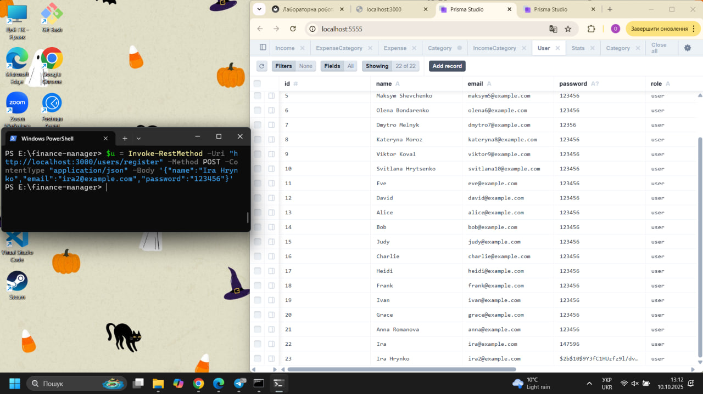
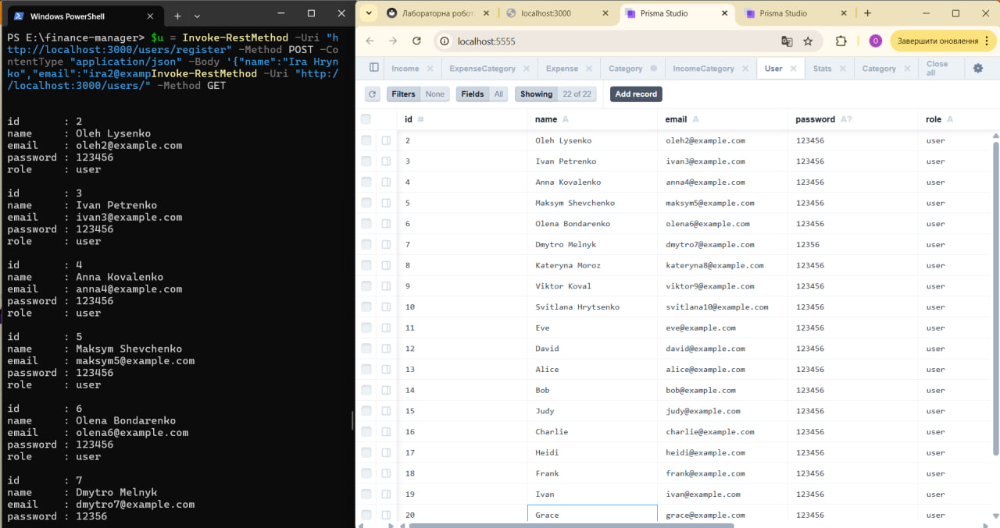
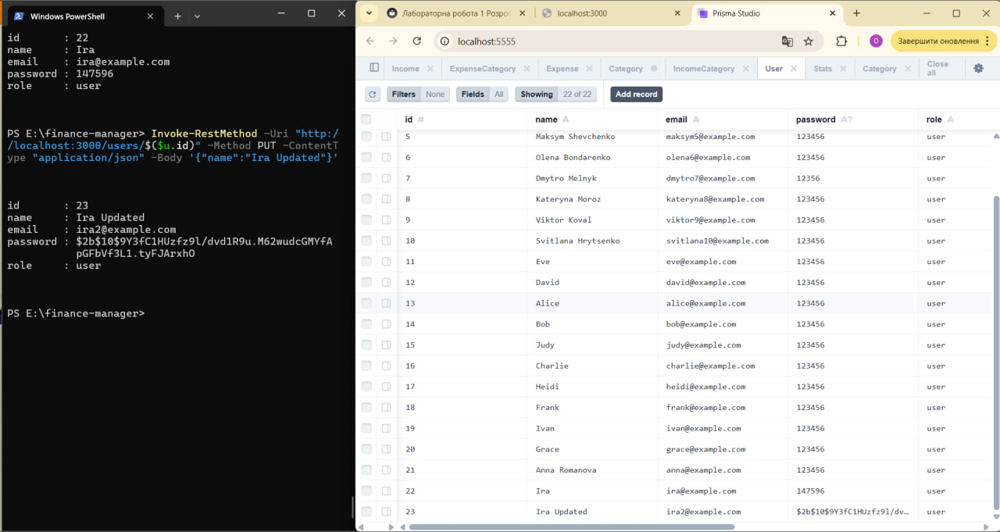
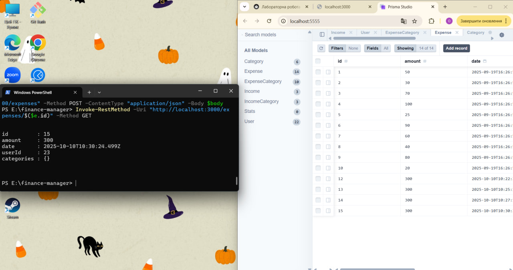
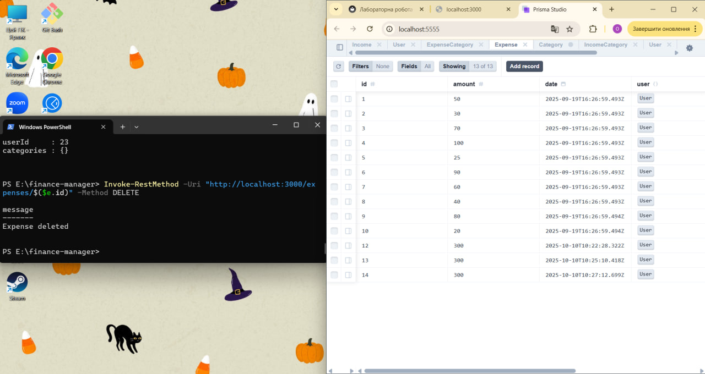
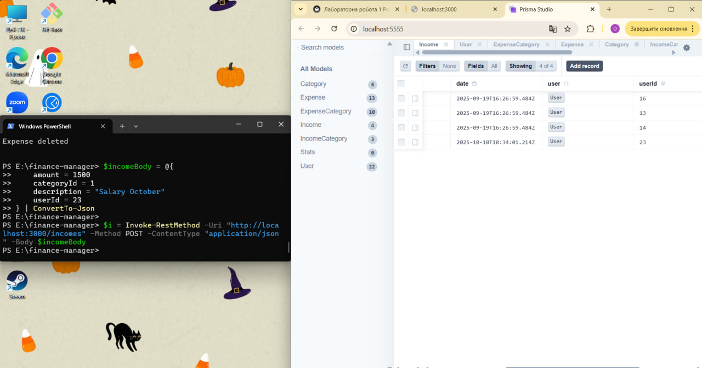
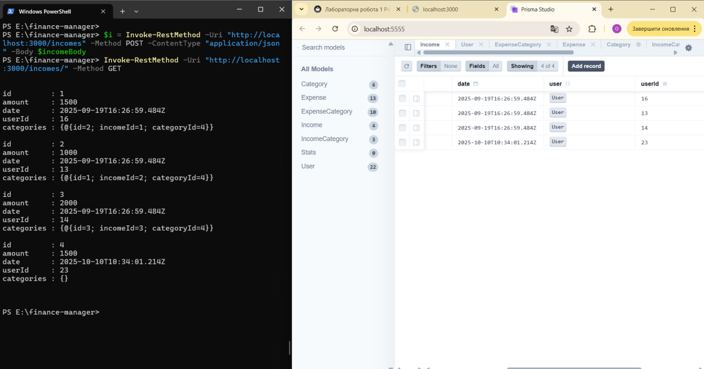
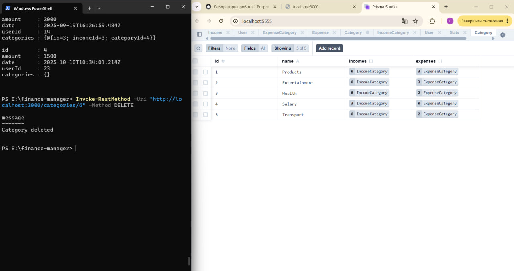
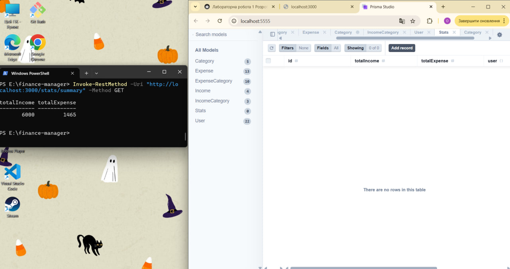

# Звіт з лабораторної роботи 1

## Тема роботи: Розроблення backend архітектури та основного функціоналу

Здобувач освіти: Максімик Ольга Анатоліївна
Група: ІПЗ-42
GitHub репозиторій: [посилання]

## Виконання роботи

### Налаштування проєкту
 - Ініціалізовано Node.js проєкт за допомогою npm init
 - Встановлено необхідні залежності: 
    express для створення сервера 
    @prisma/client та prisma для роботи з базою даних 
    bcryptjs для хешування паролів dotenv для роботи зі змінними середовища

 - Налаштовано структуру файлів: 
     src/controllers/ – контролери для обробки запитів 
     src/routes/ – маршрути для API 
     src/models/ – моделі бази даних 
     prisma/schema.prisma – опис структури бази даних 
     server.js – основний файл запуску сервера 
     .env – конфігураційні змінні середовища 

### База даних
- Налаштовано PostgreSQL як систему керування базою даних 
- Створено Prisma схему з таблицями: User, Income, Expense, Category Stats 
- Виконано міграції за допомогою Prisma для створення таблиць у базі даних 
- Встановлено зв’язки між таблицями: Income та Expense пов’язані з User через userId Income та Expense пов’язані з Category через categoryId

### Backend архітектура
- Створено Express.js сервер для обробки HTTP-запитів 
- Реалізовано MVC архітектуру: 
    Models – Prisma моделі для роботи з базою даних 
    Controllers – логіка обробки запитів та взаємодії з моделями 
    Routes – маршрути для організації API
- Впроваджено middleware: 
    express.json() для парсингу JSON-запитів
    Можливість додати кастомні middleware для авторизації, логування або обробки помилок

### API endpoints

# Users

- POST /api/users/register — реєстрація (PUBLIC)
- POST /api/users/login — логін (PUBLIC)
- GET /api/users — отримати всіх користувачів (ADMIN)
- GET /api/users/:id — отримати користувача по ID (ADMIN)
- PUT /api/users/:id — оновити користувача (ADMIN)
- DELETE /api/users/:id — видалити користувача (ADMIN)

# Incomes

- GET /api/incomes — всі доходи (PUBLIC)
- GET /api/incomes/:id — дохід по ID (PUBLIC)
- POST /api/incomes — створити дохід (ADMIN)
- PUT /api/incomes/:id — оновити дохід (ADMIN)
- DELETE /api/incomes/:id — видалити дохід (ADMIN)

# Expenses

- GET /api/expenses — всі витрати (PUBLIC)
- GET /api/expenses/:id — витрата по ID (PUBLIC)
- POST /api/expenses — створити витрату (ADMIN)
- PUT /api/expenses/:id — оновити витрату (ADMIN)
- DELETE /api/expenses/:id — видалити витрату (ADMIN)

# Categories

- GET /api/categories — всі категорії (PUBLIC)
- GET /api/categories/:id — категорія по ID (PUBLIC)
- POST /api/categories — створити категорію (ADMIN)
- PUT /api/categories/:id — оновити категорію (ADMIN)
- DELETE /api/categories/:id — видалити категорію (ADMIN)

# Stats

- GET /api/stats/summary — загальна статистика (PUBLIC)
- GET /api/stats/by-category — статистика по категоріях (PUBLIC)
- GET /api/stats/by-user — статистика по користувачах (PUBLIC)

## Структура проєкту

finance-manager/
├── src/
│   ├── controllers/
│   │   ├── userController.js
│   │   ├── incomeController.js
│   │   ├── expenseController.js
│   │   ├── categoryController.js
│   │   └── statsController.js
│   ├── routes/
│   │   ├── userRoutes.js
│   │   ├── incomeRoutes.js
│   │   ├── expenseRoutes.js
│   │   ├── categoryRoutes.js
│   │   └── statsRoutes.js
│   ├── models/
│   │   ├── userModel.js
│   │   ├── incomeModel.js
│   │   ├── expenseModel.js
│   │   ├── categoryModel.js
│   │   └── statsModel.js
│   ├── modules/
│   │   └── auth.js
│   ├── utils/
│   │   └── validation.js
│   └── app.js
├── prisma/
│   └── schema.prisma
├── reports/
│   └── lab1-report(1).md
├── .env
├── .gitignore
├── package.json

## Скріншоти тестування

## Висновки

Самооцінка: [ваша оцінка роботи, 5-5]

Обгрунтування: Усі завдання виконані, CRUD працює, структура проєкту налаштована, тестування проведено.
